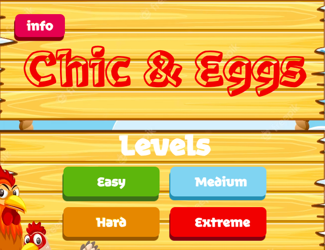

# ![] ~ ~ ~ Chic & Eggs ~ ~ ~ ![]

## ! IMPORTANT INFORMATION !

1 - Upon launching the game, you will be directed to the homepage, where you can choose the desired level to play.
 
2 - It is essential to note that the performance of the game may vary on different browsers. Most browsers may exhibit some level of sprite animation flickering. However, Firefox stands out as it consistently displays the sprite images, though it might take a little longer for the animations to initiate.

   

## What is this project?

This project marks the collaborative effort of three individuals, serving as our inaugural creation for Module 1 of the Ironhack Full-Stack Web Development - Remote Bootcamp.

   

## === Story-Info ===

Our project centers around an engaging game that challenges players to uncover a hidden word through a series of trials, each level offering a different number of attempts ('n') to unravel the mystery.

You have the option to reset the word and begin with a fresh one. The game will provide information about your guesses, displaying relevant feedback as you progress.

#### Main Menu:

- "Select Level" - Allows users to choose the desired difficulty level for the game:
  Easy : 3 Letter word challenge
  Medium : 4 Letter word challenge
  Hard : 5 Letter word challenge
  Extreme : 6 Letter word challenge
- "Info Button" - Provides information about the game
- "Trials" - Displays the number of attempts or trials available to the user.
- "Input" - Enables users to enter their guessed word into the provided boxes.
- "Feedback" - Offers informative responses regarding the guessed word:
  Chick - correct letter, correct position.
  Egg - correct letter, wrong position.
  Crow - Wrong letter
- "Back Button" - Takes user back to the home screen
- "Reset Button" - Allows users to start afresh by resetting the word.
- "Pop-up" - Notifies users about whether they have won or lost the game.

  

#### Controls:
- Tab  | Move Right
- Enter | Submit 

  

_________________________________________________________________________________________________

  

### === Game Structure in VS Project ===

#### === index.html ===
Handles the different screens for:
- Start Screen
- Info Popup
- Easy Screen
- Medium Screen
- Hard Screen
- Extreme Screen
- Win/Lose display Popup

  

#### === style/style.css ===
Handles the layout for "index.html" and auto-hides the info popup, win display and lose display until activated.

  

#### === js/game.js ===
Contains the class that are being defined for the game.

#### Class:
- Game

  

#### === js/script.js ===
Defines different arrays containing sets of words, from which we will randomly choose words.

Defines the logic for the key press and level selection inside the "window.onload ()" function, in order:

- Event listener to handle key presses.
- Declares "appendVariable()" - declaring variables for appending earlier attempts and displaying hidden word
- Event listener for level selection

Defines  "movetoNext()" - Automatically moves the cursor to the next input field

Defines "goBtn()"
- Converts the guessed word into lowercase
- Checks if the guessed word is valid, containing only alphabets and no repeating letters.
- Compares the guessed word with the hidden word.
- Appends previous attempts to the display.
- Checks if the game is over and reveals the hidden word.

 Event listeners for for buttons related to going back, reloading, and closing pop-ups.

